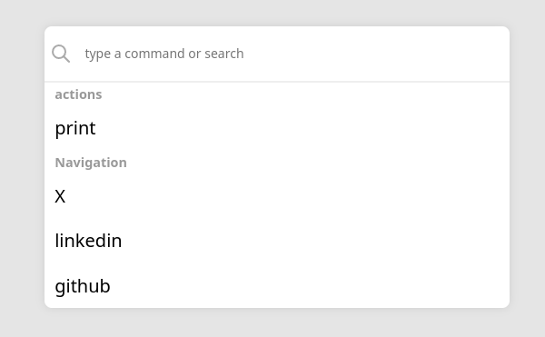

# cmd-console-web

## Description 

 a web-based console customizable,designed with javascript and css  using how base the web components.no additional dependencies

## Installation

```bash
npm install cmd-console-web
```

## Usage

```javascript
import 'cmd-console-web';

const menu = document.querySelector('app-menu')
menu.config = { key:"m",
        groups : [
            {
                name:"actions",
                elements:[
                    {
                         name:"print",
                        callback: () => print()
                    }
                ]
            }
            ,{
        name:"Navigation",
        elements:[{
            name:"X",
            callback :  () => open("https://www.X.com")
        },
        {
            name:"linkedin",
            callback () {open("https://www.linkedin.com")}
        }
    ]
    }]
    menu.render()
        
}

```

```html
<app-menu></app-menu>
```